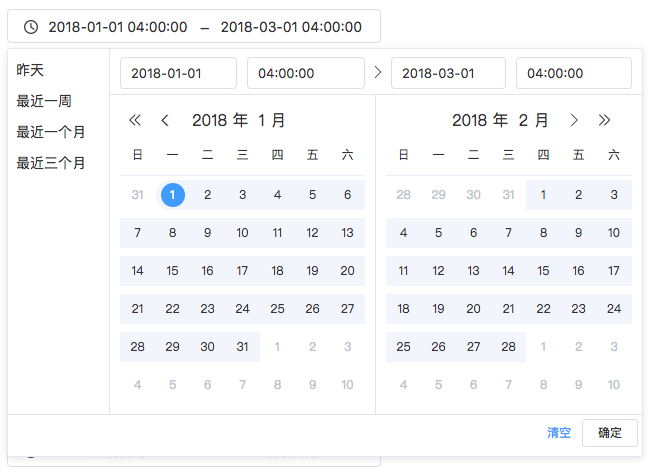
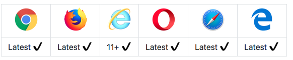

# Datepicker.js 

> Complete functions, to meet the simple configuration to complete complex needs. More types, more choices.



**Datepicker.js**:

- 支持十分秒年月日范围选择
- 最大最小值限制
- 限制开始结束时间间隔最大值
- 快捷选项简易配置
- 支持只选年月，只选年

ui仿vue element-ui datapicker组件，实现jquery版本。一直没找到满意的开源jquery时间插件，所以自己写一个用在项目上，并开源出来，希望对你有帮助


 [Demo](https://qiuyaofan.github.io/datepicker/) 


## Browser Install


```
// picker css（加载了fonts,具体看scss文件夹）
<link rel="stylesheet" href="css/datepicker.css">

// rely on plugins
<script src="js/plugins/jquery.js"></script>
<script src="js/plugins/moment.min.js"></script>
// picker js
<script src="js/datepicker.all.min.js"></script>
```


## Usage

In HTML, add an identifier to the element:

```html
<div class="c-datepicker-date-editor c-datepicker-single-editor J-datepicker-day">
    <i class="c-datepicker-range__icon kxiconfont icon-clock"></i>
    <input type="text" autocomplete="off" name="" placeholder="选择日期" class="c-datepicker-data-input only-date" value="">
</div>
```

All you need to do now is just instantiate datepicker as follows:

```js
// 年月日单个(J-datepicker-day对应html里的input父元素div)
$('.J-datepicker-day').datePicker({
	hasShortcut: true,
	format:'YYYY-MM-DD',
	shortcutOptions: [{
	  name: '今天',
	  day: '0'
	}, {
	  name: '昨天',
	  day: '-1'
	}, {
	  name: '一周前',
	  day: '-7'
	}]
});
```
or  datepicker with range reference:

```html
<div class="c-datepicker-date-editor  J-datepicker-range-day">
  <i class="c-datepicker-range__icon kxiconfont icon-clock"></i>
  <input placeholder="开始日期" name="" class="c-datepicker-data-input only-date" value="">
  <span class="c-datepicker-range-separator">-</span>
  <input placeholder="结束日期" name="" class="c-datepicker-data-input only-date" value="">
</div>
```

```js
//年月日范围
$('.J-datepicker-range-day').datePicker({
	hasShortcut: true,
	format: 'YYYY-MM-DD',
	isRange: true,
	shortcutOptions: [{
		name: '最近一周',
		day: '-7,0'
	}, {
		name: '最近一个月',
		day: '-30,0'
	}, {
		name: '最近三个月',
		day: '-90, 0'
	}]
});
```

or with range ,min and max,format is 'YYYY-MM-DD HH:mm:ss'

```html
<div class="c-datepicker-date-editor J-datepicker-range">
  <i class="c-datepicker-range__icon kxiconfont icon-clock"></i>
  <input placeholder="开始日期" name="" class="c-datepicker-data-input" value="">
  <span class="c-datepicker-range-separator">-</span>
  <input placeholder="结束日期" name="" class="c-datepicker-data-input" value="">
</div>
```

```js
$('.J-datepicker-range').datePicker({
    hasShortcut: true,
    min: '2018-08-31 00:00:00',
    max: '2019-08-31 23:59:59',
    isRange: true,
    shortcutOptions: [{
      name: '昨天',
      day: '-1,-1',
      time: '00:00:00,23:59:59'
    },{
      name: '最近一周',
      day: '-7,0',
      time:'00:00:00,'
    }, {
      name: '最近一个月',
      day: '-30,0',
      time: '00:00:00,'
    }, {
      name: '最近三个月',
      day: '-90, 0',
      time: '00:00:00,'
    }]
  });
```

datapicker-separate里为all.js分开的文件，想看看实现可以看这个文件夹

## Config
|参数名|默认值（可选值）|作用|类型|
|----|-----|-----|-----|
|format|YYYY-MM-DD HH:mm:ss|datepicker 类型| String |
|isRange|false|是否范围选择| Boolean |
|min|false|时间最小值| false/String |
|max|false|时间最大值| false/String |
|hasShortcut|false|是否开启快捷选项| Boolean |
|shortcutOptions|[]|快捷选项配置参数|Array |
| between |false| 开始和结束值之间的时间间隔天数（只对范围有效）| false/Number |

## Browser Support



## Changelog

2018-09-05：v1.0.0上线

